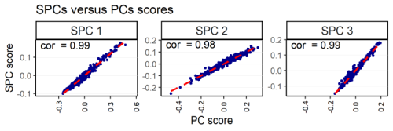

<!--
--- 
title: "R Package LSSPCA" 
---
author: "Giovanni Merola" 
output: html 
-->
# R Package LSSPCA
<!-- badges: start -->
 
 
 "

<!-- badges: end -->

  This R package is a companion to my tutorial paper published on xxx and computes sparse principal components. 
  
  LSSPCA provides only 3 functions 
  
-  *lsspca* is the basic function to it computes sparse PCs. 

-  *lsspca_blocked* computes lsspca on specified subsets of variables.

-  *makevexp* computes the variance explained by any component, also not computed with *lsspca*, of course.

It also provides to utilities (not methods for various reasons)

- *print_spca* prints the sparse loadings

- *summary_spca* prints summary statistics for an onìbject produced with lsspca or lsspca_blocked

  This is a lightweight package not designed to handle large matrices. A dated (but working, made obsolete on CRAN)  package with methods for plotting and visualizing the PCs is available at [here](https://github.com/merolagio/spca) (or *devtools::install_github("merolagio/spca")*). A new version with fast C++ code and PSPCA is in the making and will be released on CRAN one day. By the way, if you find this package useful, please acknowledge my work. It will make my manager happy :wink:

  The number of nonzero loadings can be controlled by changing the parameter *alpha* (which is the minimal proportion of variance explained by the Principal Components to be reproduced).
  
  Orthogonal sparse components (USPCA) are computed by choosing *spcaMethod = "u"*. Correlated components (CSPCA) can be obtained by choosing *spcaMethod = "c"*. The higher order CSPCA components may explain a bit more variance at the price of being correlated. 
  
  The variables can be selected by using exhaustive, stepwise, forward or backward selection via the argument *subsetSelection* options "e", "s", "f" and "b", respectively.
  
  An example of sparse loadings is in this image
  

  The sparse PCs are combinations of only 2, 3 and 4 variables out of 16 but are a (very) close approximation to the original PCs. see by yourself:

  Well, the idea is to approximate the data as well as possible with sparse components. Since the PCs give the best approximation of the data, approximating the PCs is pretty much the same thing. So, decent sparse components can be obtained by simply projecting (yes, by simple linear regression, PSPCA) the PCs on a subset of variables, option *spcaMethod = "p"*.
  
  Explanations, details and examples about LS SPCA can be found in the tutorial paper xxx.  
  
  More can be found in the mathematically oriented papers:

-  Merola, G. (2015). Least squares sparse principal component analysis: a backward elimination approach to attain large loadings. Australia & New Zealand Journal of Statistics, 57:391–429. [pdf](https://arxiv.org/abs/1406.1381)

-  Merola, G. M. and Chen, G. (2019). Projection sparse principal component analysis: An efficient least squares method. Journal of Multivariate Analysis, 173:366–382. [pdf](https://arxiv.org/abs/1612.00939)

  A discussion about sparsifying rotated principal components can be found in

-  Merola, G. M. (2020). Simpca: a framework for rotating and sparsifying principal components. Journal of Applied Statistics, 47(8):1325–1353. [pdf](https://arxiv.org/abs/1910.03266)

  Ahhh, before I forget: LS SPCA is much better than other SPCA methods because it maximizes the variance explained and produces orthogonal components which are combinations of key variables. Other methods do not and have serious problems with correlated variables. All explained and proved in my papers.
